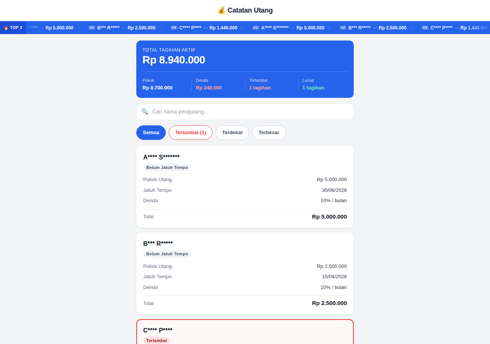

# 💰 Catatan Utang

Website sederhana untuk mencatat utang, dibangun dengan **React + Vite** tanpa backend.

## Screenshot



## Cara Edit Data (Branch `data`)

Data utang sekarang dikelola dari branch **`data`** di file root **`debts.json`**.

Format item:

```json
{
  "id": "1",
  "nama": "Nama Pengutang",
  "jumlah": 1000000,
  "tempo": "30/09/2026",
  "denda": 10,
  "lunas": false
}
```

Setelah update `debts.json` di branch `data` dan push, workflow akan build lalu deploy otomatis.

## Auto-Deploy (GitHub Actions)

- `.github/workflows/deploy.yml` → deploy saat ada push ke `main` (perubahan kode)
- `.github/workflows/deploy-from-data.yml` → deploy saat ada push ke `data` (perubahan data)

## Jalankan Lokal

```bash
npm install
npm run dev
```

## Struktur File

```
src/
├── data/
│   ├── debts.js            ← loader data dari debts.json
│   └── debts.json          ← fallback data lokal
├── components/
├── utils/
└── App.jsx
```
